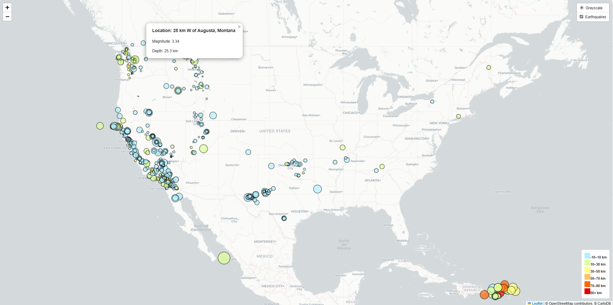
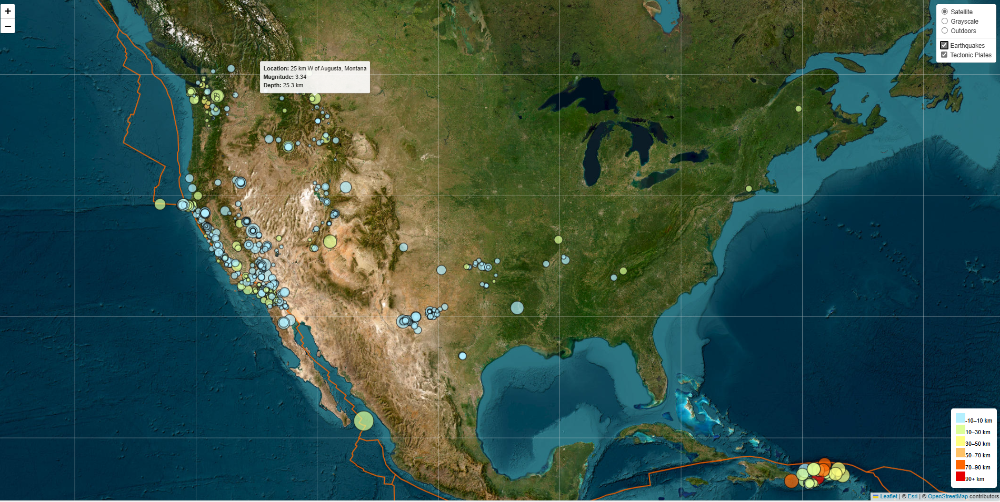

# Earthquake Visualization Project

## Background

The United States Geological Survey, or USGS for short, is responsible for providing scientific data about natural hazards, the health of our ecosystems and environment, and the impacts of climate and land-use change. Their scientists develop new methods and tools to supply timely, relevant, and useful information about the Earth and its processes.

The USGS is interested in building a new set of tools that will allow them to visualize their earthquake data. They collect a massive amount of data from all over the world each day, but they lack a meaningful way of displaying it. In this challenge, we have been tasked with developing a way to visualize USGS data that will allow them to better educate the public and other government organizations (and hopefully secure more funding) on issues facing our planet.

## Part 1: Create the Earthquake Visualization

### Features
- **Map Setup**: A map created using Leaflet displays earthquake data pulled from the USGS API.
- **Circle Markers**: Earthquakes are represented with circle markers, where the size corresponds to the magnitude and the color represents the depth.
- **Popups**: Each marker has a popup showing the location, magnitude, and depth of the earthquake.
- **Legend**: A legend is included to show the depth ranges and their corresponding colors.

### Part 1 Screenshots
Below is a screenshot of the working earthquake map showing the markers with tooltips and a legend:

## Part 2: Gather and Plot More Data (Optional)

This part of the project involves adding tectonic plates data to the map to illustrate the relationship between tectonic plates and seismic activity.

### Features
- **Tectonic Plates Layer**: The tectonic plate boundaries are added to the map alongside the earthquake data.
- **Layer Control**: Users can toggle between the earthquake markers and tectonic plates layer using the map's layer controls.
- **Base Maps**: Multiple base maps are provided, such as satellite, grayscale, and outdoors.

### Part 2 Screenshots
Below is a screenshot of the map with both earthquake and tectonic plate data visualized:

## How It Works

1. The project fetches earthquake data from the USGS API:
   - The data includes the magnitude, location, and depth of earthquakes occurring in the past week.

2. The data is processed and displayed as circle markers on a Leaflet map.

3. The size of the circle is proportional to the earthquake's magnitude.

4. The color of the circle represents the depth of the earthquake.

5. Tooltips are added to display earthquake information (location, magnitude, depth) when hovering over a marker.

6. Tectonic plate boundaries are drawn on the map to visualize plate movements.

## Libraries and Tools
- **Leaflet**: A JavaScript library for building interactive maps.
- **D3.js**: A JavaScript library for manipulating documents based on data, used for loading and processing GeoJSON data.
- **GeoJSON**: A format for encoding geographic data structures, used for earthquake and tectonic plate data.
- **HTML/CSS**: Basic web technologies to structure and style the webpage.
